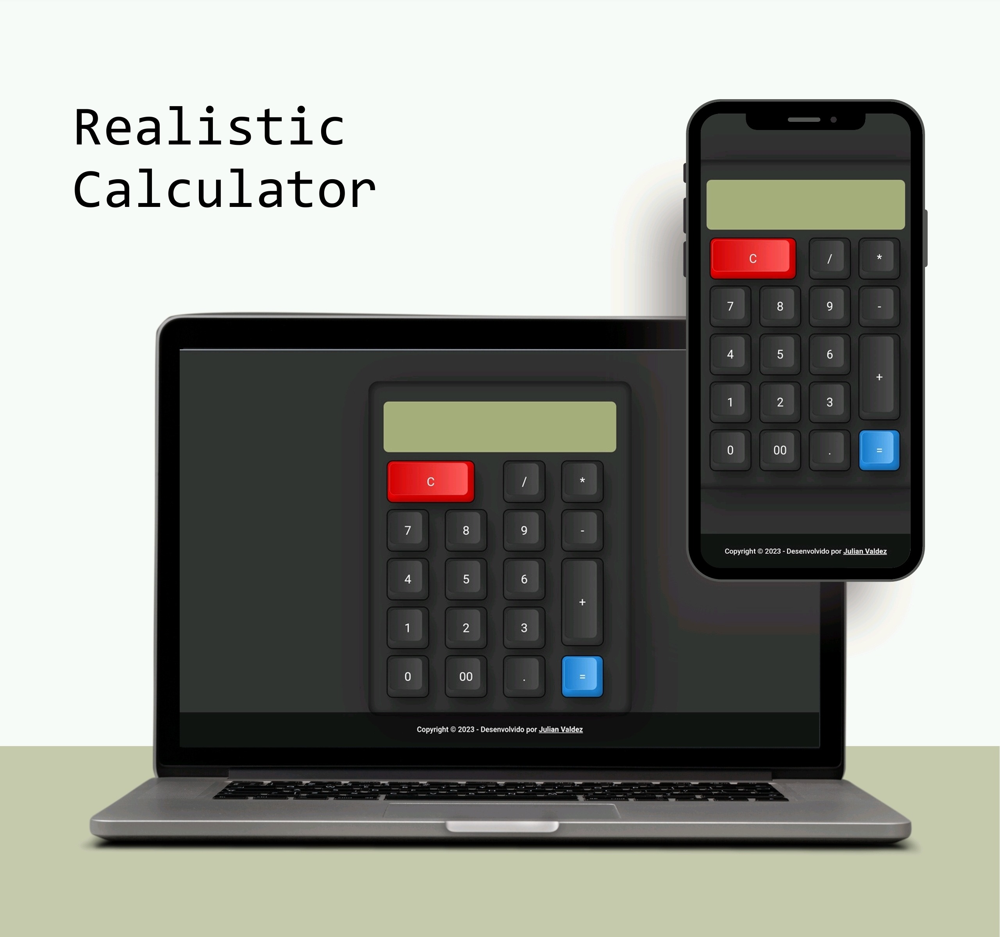

# 🧮 Calculadora Realista

Uma calculadora realista desenvolvida em HTML e CSS.

## Demonstração

## Recursos Principais

- Interface intuitiva e realista
- Operações básicas (adição, subtração, multiplicação, divisão)

